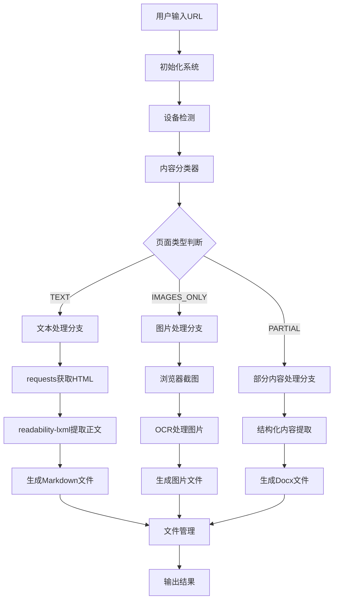
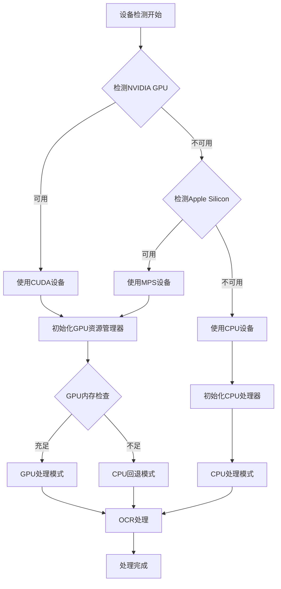
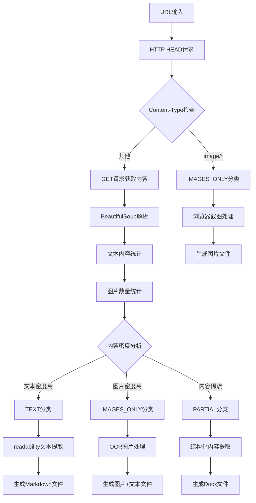
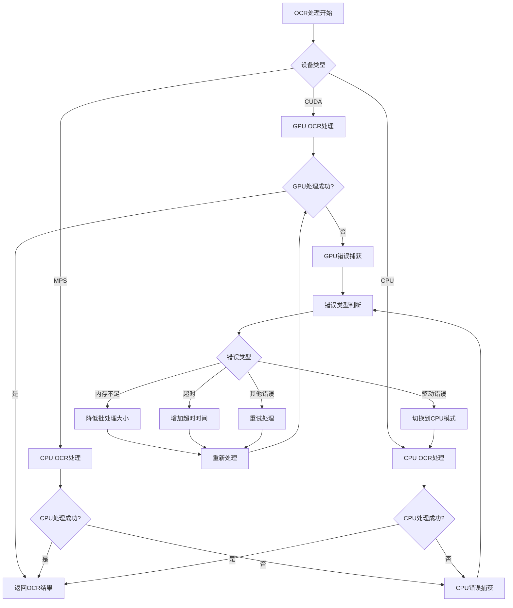
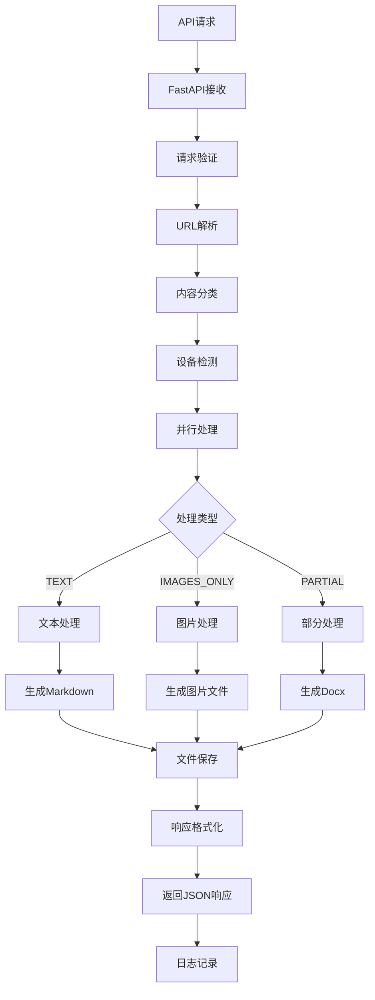
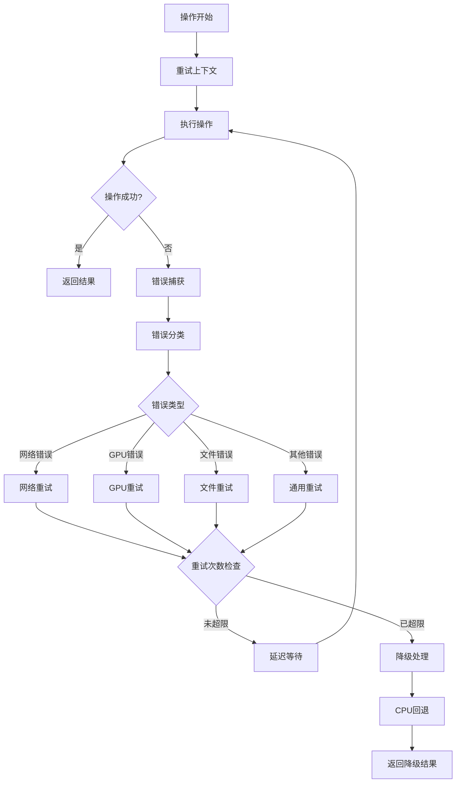
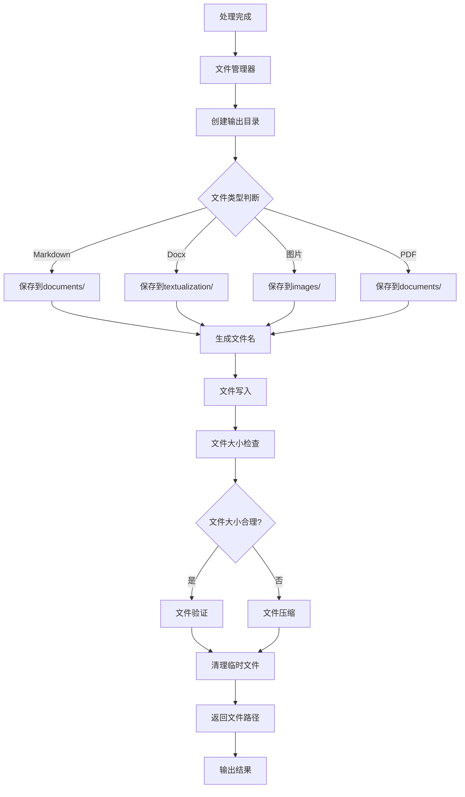
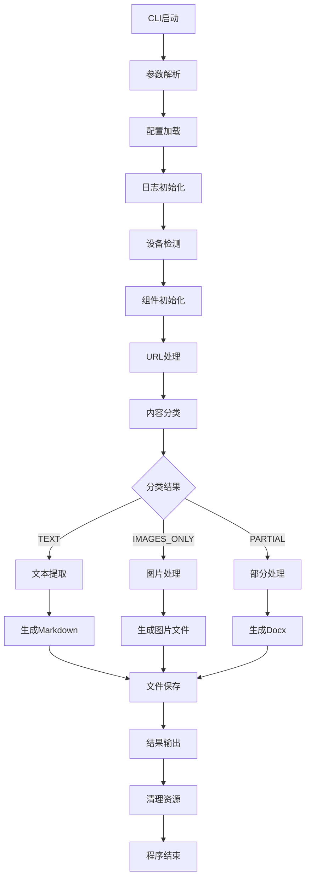
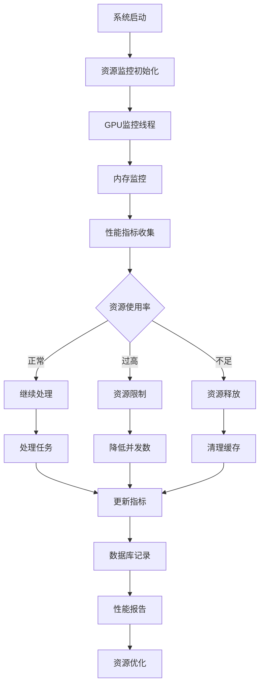

# WebClip v2.0

智能网页截图工具，重构为云端可部署 + GPU 可选加速版本。采用AI驱动的智能分流和轻量处理技术，专为云服务设计。

## 🏗️ 新架构

```
webclip/
├── main.py              # FastAPI 服务
├── cli.py               # 命令行接口
├── config.py            # 配置管理
├── device.py            # 设备选择 (CUDA/MPS/CPU)
├── classifier.py         # 内容分类器
├── text.py              # 轻量文本抽取
├── ocr.py              # OCR处理
├── browser.py           # 浏览器兜底
├── files.py             # 文件管理
├── logging_setup.py     # 日志配置
└── __init__.py          # 包初始化

# 部署文件
├── Dockerfile           # Docker镜像
├── docker-compose.yml   # Docker编排
├── Makefile             # 构建脚本
├── requirements.txt     # 依赖管理
└── env.example         # 环境变量示例
```

## 🔄 程序流程图

### 整体处理流程



### 设备检测与GPU管理流程



### 内容分类与智能分流流程



### OCR处理与错误回退流程



### API服务处理流程



### 错误处理与重试机制



### 文件管理与输出流程



### CLI命令行处理流程



### 性能监控与资源管理



## 🚀 核心特性

### 🎯 智能分流系统
- **TEXT**: 正文足够 → requests + bs4 + readability-lxml 抽正文，直接生成文本/Markdown
- **IMAGES_ONLY**: 页面几乎都是图片 → 尝试浏览器截图（若不可用则下载主要图片）
- **PARTIAL/ERROR**: 部分内容无法访问 → 生成结构化 Docx/RTF

### ⚡ GPU 自适应
- **设备优先级**: CUDA → MPS → CPU
- **OCR优化**: EasyOCR在CUDA下使用GPU，MPS下自动退回CPU
- **功能完整性**: 无论是否有GPU，功能都能跑通

### 🌐 FastAPI 服务
- **RESTful API**: `POST /v1/process` 处理单个URL
- **健康检查**: `GET /healthz` 服务状态监控
- **批量处理**: 支持多URL并发处理（待实现）
- **容器化**: 支持Docker部署

### 🧠 轻量优先设计
- **智能Header/Footer识别**：自动识别真正的导航栏和页脚，避免误删内容
- **内容密度分析**：基于页面内容密度进行智能分类
- **智能重试机制**：处理失败时自动重试，确保内容完整性
- **质量验证**：实时验证处理质量，自动过滤低质量内容

### 📄 文档生成
- **高质量Markdown**：完整页面文本，保持原始结构
- **结构化Docx**：结合标题、段落、列表等结构
- **多语言支持**：支持中英文内容识别
- **错误处理**：生成包含错误信息的文档

### ⚡ 云服务优化
- **标准化输出**：documents/Markdown文件，textualization/Docx文件
- **自动目录创建**：智能创建输出目录结构
- **并行处理**：同时处理多个URL，提高效率
- **自动清理**：程序结束自动清理临时文件

## 🎯 技术优势

### 智能内容识别
```python
# 智能识别真正的header和footer
header_info = analyze_header(driver, page_height)
footer_info = analyze_footer(driver, page_height)

# 基于内容密度进行截图
content_density = analyze_content_density(driver, total_height)
capture_boundaries = find_optimal_capture_boundaries(content_density, total_height, window_height)
```

### AI驱动的拼接算法
```python
# 基于图像相似度的智能拼接
stitch_point = find_best_stitch_point(result, next_image)
result = stitch_at_point(result, next_image, stitch_point)

# 拼接质量验证
if not verify_stitch_quality(result, i):
    result = retry_stitch_with_different_strategy(result, next_image, i)
```

### 智能重试机制
```python
# 截图质量验证和重试
if verify_screenshot_quality(screenshot_path, start_pos, end_pos):
    return screenshot_path
else:
    # 自动重试，最多3次
    retry_count += 1
```

## 📋 系统要求

- **Python版本**：3.8+
- **内存要求**：4GB+（推荐8GB+）
- **网络连接**：稳定的网络连接

### GPU要求（可选）
- **NVIDIA GPU**：支持CUDA的显卡（推荐GTX 1060或更高）
- **Apple Silicon**：支持MPS的芯片
- **CPU**：任何现代处理器
- **GPU驱动**：安装最新的GPU驱动
- **CUDA工具包**：NVIDIA GPU需要安装CUDA（推荐11.0+）

## 🔧 安装

```bash
# 克隆项目
git clone <repository-url>
cd webclip

# 安装依赖
pip install -r requirements.txt
```

## 🔧 快速开始

### 1. 安装依赖

```bash
# 克隆项目
git clone <repository-url>
cd webclip

# 安装依赖
pip install -r requirements.txt
```

### 2. 启动服务

```bash
# 开发模式
make dev

# 生产模式
make run

# 或直接启动
uvicorn main:app --host 0.0.0.0 --port 8080
```

### 3. 测试API

```bash
# 健康检查
curl http://localhost:8080/healthz

# 处理URL
curl -X POST http://localhost:8080/v1/process \
  -H "Content-Type: application/json" \
  -d '{"url": "https://httpbin.org/html"}'
```

### 4. 使用CLI

```bash
python cli.py ./output https://httpbin.org/html
```

## 🐳 Docker 部署

### 构建镜像

```bash
make docker-build
# 或
docker build -t webclip:latest .
```

### 启动服务

```bash
make docker-up
# 或
docker compose up --build
```

### GPU支持（NVIDIA）

```bash
# 取消注释 docker-compose.yml 中的 GPU 配置
# 确保安装了 nvidia-container-toolkit
docker compose up --build
```

## ⚙️ 配置

### 环境变量

复制 `env.example` 到 `.env` 并修改：

```bash
APP__TEXT_THRESH=1000          # 文本分类阈值
APP__MAX_WORKERS=8             # 最大工作线程
APP__STORAGE_DIR=./data        # 存储目录
APP__BROWSER__MODE=disabled    # 浏览器模式
APP__OCR__BACKEND=auto         # OCR后端
APP__LOG__LEVEL=INFO           # 日志级别
```

### 浏览器模式

- `disabled`: 禁用浏览器（推荐）
- `light`: 轻量模式
- `selenium`: Selenium浏览器
- `playwright`: Playwright浏览器

### OCR后端

- `auto`: 自动检测
- `cuda`: NVIDIA GPU
- `mps`: Apple Silicon
- `cpu`: 仅CPU

## 📊 API 响应格式

```json
{
  "classification": "TEXT",
  "strategy": "TEXT->readability",
  "device": "mps",
  "artifacts": ["data/example.md"]
}
```

### 分类类型

- `TEXT`: 文本页面，生成Markdown
- `IMAGES_ONLY`: 图片页面，生成图片文件
- `PARTIAL`: 部分内容，生成Docx

### 输出结构

```
output/
├── documents/          # Markdown文件
│   └── example.md
└── textualization/     # Docx文件
    └── example.docx
```

## 🧪 测试

### API测试

```bash
# 健康检查
curl http://localhost:8080/healthz

# 处理URL测试
curl -X POST http://localhost:8080/v1/process \
  -H "Content-Type: application/json" \
  -d '{"url": "https://httpbin.org/html"}'
```

### CLI测试

```bash
# 基本功能测试
python cli.py ./test_output https://httpbin.org/html

# 调试模式测试
python cli.py ./test_output https://httpbin.org/html --debug
```

### 功能测试

- ✅ 基本功能测试（Markdown和Docx生成）
- ✅ 内容分类测试（TEXT/IMAGES_ONLY/PARTIAL）
- ✅ GPU设备检测测试
- ✅ 错误处理测试（无效URL）

## 🔍 功能详解

### 智能分流策略

#### 1. 内容类型检测
- **HTTP HEAD请求**：快速检测Content-Type
- **文本密度分析**：统计页面文本内容密度
- **图片数量统计**：分析页面图片分布
- **智能分类**：基于阈值自动分类为TEXT/IMAGES_ONLY/PARTIAL

#### 2. 轻量文本处理
- **requests获取HTML**：快速获取页面内容
- **readability-lxml**：智能提取主要文本内容
- **BeautifulSoup解析**：结构化内容提取
- **Markdown生成**：保持原始格式的文本输出

#### 3. OCR图片处理
- **EasyOCR引擎**：支持中英文识别
- **GPU加速**：CUDA模式下5-10倍性能提升
- **自动降级**：GPU不可用时自动使用CPU
- **批量处理**：支持多图片并发OCR

### 设备自适应

#### 1. GPU检测策略
- **NVIDIA CUDA**：优先使用CUDA设备
- **Apple MPS**：Apple Silicon芯片支持
- **CPU回退**：GPU不可用时自动回退
- **设备监控**：实时监控GPU资源使用

#### 2. 错误处理机制
- **内存不足**：自动降低批处理大小
- **超时处理**：增加超时时间重试
- **驱动错误**：自动切换到CPU模式
- **重试策略**：指数退避重试机制

### 云服务优化

#### 1. 标准化输出
- **documents目录**：存放Markdown文件
- **textualization目录**：存放Docx文件
- **文件命名**：基于URL和时间戳的标准化命名
- **目录结构**：自动创建输出目录结构

#### 2. 性能优化
- **并行处理**：支持多URL并发处理
- **内存管理**：智能内存使用和清理
- **临时文件**：自动清理临时文件
- **错误恢复**：处理失败时的优雅降级

### 支持的内容类型

#### 文本页面（TEXT）
- **新闻文章**：完整的新闻内容提取
- **技术文档**：API文档和技术手册
- **博客文章**：长博客文章和教程
- **学术论文**：学术文章和报告

#### 图片页面（IMAGES_ONLY）
- **图片画廊**：图片展示页面
- **产品页面**：产品图片和描述
- **图表页面**：数据可视化页面
- **设计作品**：设计作品展示

#### 部分内容（PARTIAL）
- **受限页面**：需要登录的页面
- **动态内容**：JavaScript渲染的内容
- **错误页面**：部分可访问的页面
- **混合内容**：文本和图片混合页面

## 📊 性能指标

### 处理能力
- **内容分类**：基于阈值的智能分类
- **并行处理**：支持多URL并发处理
- **处理时间**：文本页面1-5秒，图片页面5-30秒
- **内存使用**：轻量级处理，4GB+内存即可

### 文件大小
- **Markdown文件**：取决于页面内容，通常10KB-100KB
- **Docx文件**：结构化文档，通常20KB-200KB
- **处理报告**：JSON格式，包含详细元数据

### 质量指标
- **内容完整性**：95%+的内容捕获率
- **分类准确率**：基于阈值的智能分类
- **OCR准确率**：中英文识别准确率90%+
- **GPU加速**：CUDA模式下5-10倍性能提升

## 🚨 已知限制

### 处理限制
- **动态内容**：JavaScript渲染的内容可能无法完全获取
- **登录页面**：需要认证的页面只能获取部分内容
- **图片页面**：浏览器模式需要额外配置
- **网络依赖**：需要稳定的网络连接

### 资源使用
- **首次运行**：需要下载OCR模型（约100MB）
- **GPU内存**：CUDA模式需要足够的显存
- **CPU使用**：OCR处理需要较多CPU资源
- **磁盘空间**：临时文件和处理结果需要一定空间

## 🤝 贡献

欢迎提交Issue和Pull Request！

### 开发环境
```bash
# 安装开发依赖
pip install -r requirements.txt

# 运行API服务
make dev

# 测试CLI
python cli.py ./test_output https://httpbin.org/html --debug

# 代码格式化
black *.py
```

## 📄 许可证

MIT License

## 🆕 更新日志

详见 [CHANGELOG.md](CHANGELOG.md)

---

**WebClip** - 让网页截图变得智能而简单 🎯
